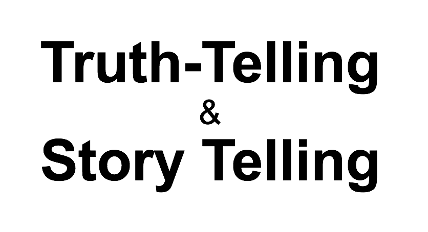
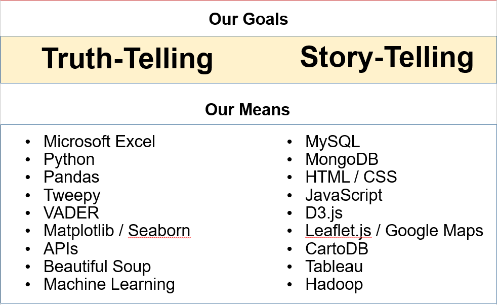
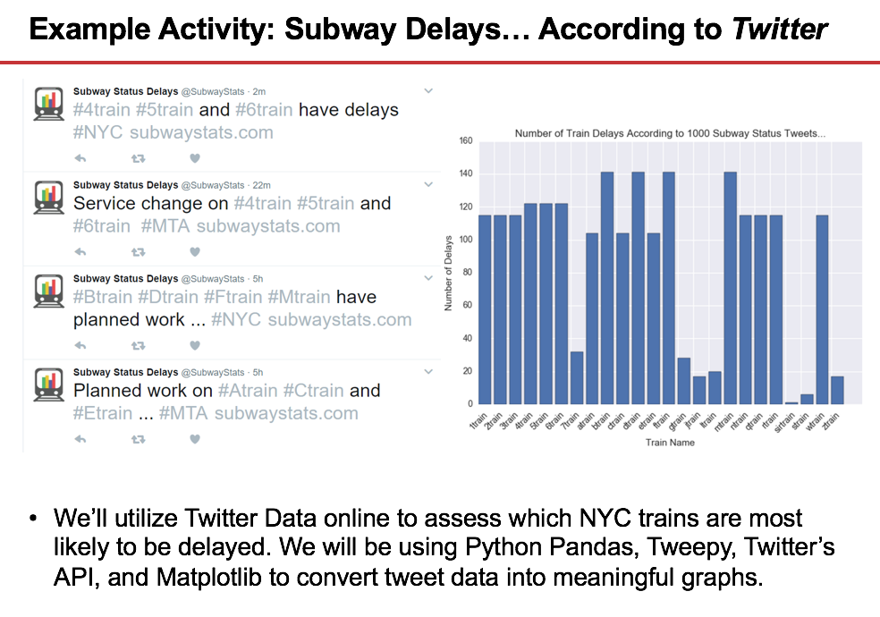
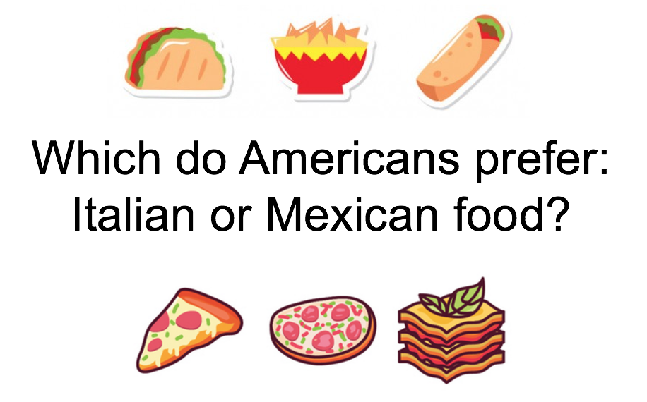
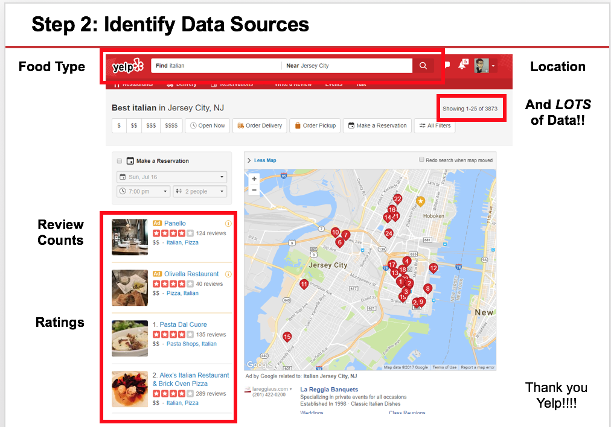
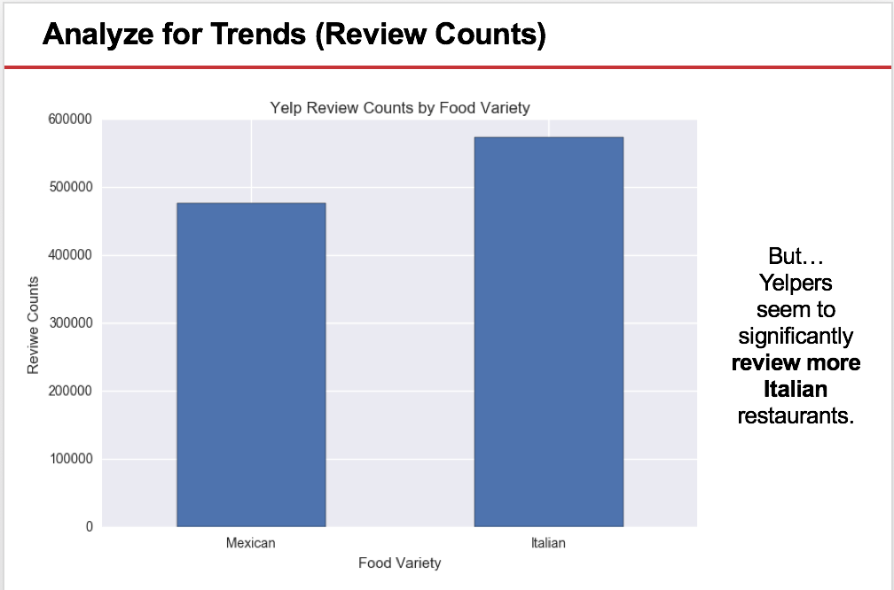
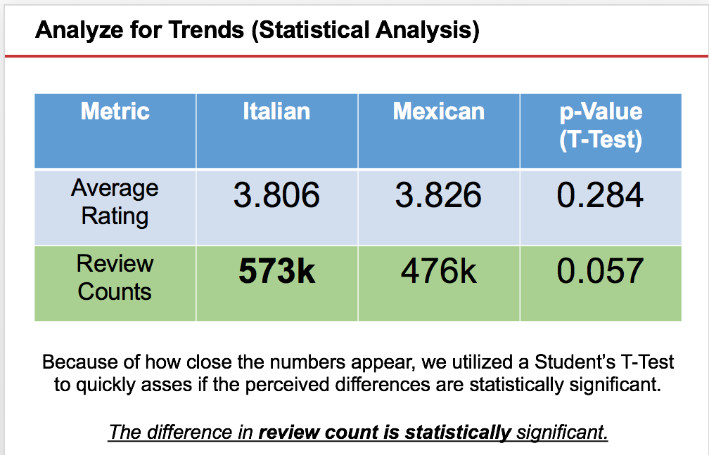
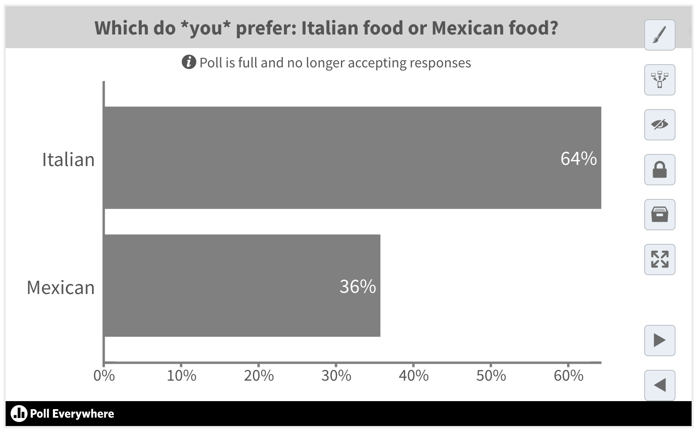
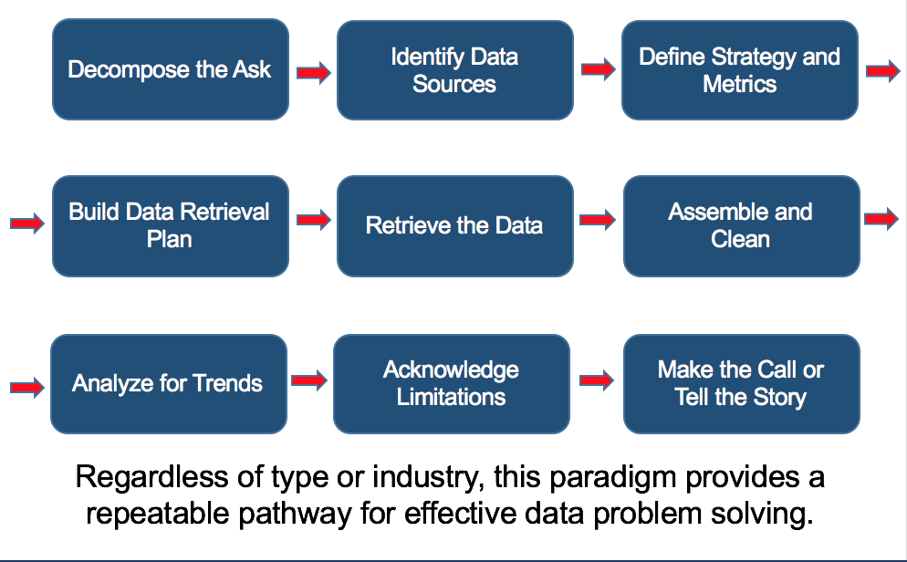

## 1.1 Lesson Plan - Zen of Data

### Overview

In this class, students will introduce themselves, become familiar with the class structure, and gain perspective on the course topics. Towards the end of class, students will also complete two group activities to encourage teamwork and analytic thinking. Have fun with this one!

### Class Objectives

* Students should feel completely welcome, excited, and ready to begin the rigorous journey ahead.
* Students will gain perspective on the course structure and general direction of the program.
* Students will gain exposure to the high-level analytic strategies and tools to be covered in class.
* Students will introduce themselves and complete ice-breaking activities together.

### Instructor Notes

* First off, welcome! And thank you for being a part of our program. Because of Instructors and TAs like yourselves, we're helping thousands of students achieve their goals and creative dreams. You've got a long road ahead and plenty of time to make an impact. So buckle in! You're in for a fun ride.

* Today's class is _all_ about making students feel comfortable. This means showing them, from the get-go, that you and your TAs are committed to their success. Many of your students will have jitters on the first day, so do what you can to engage them as friends. Make sure they know that you will support them through the struggles ahead.

* Because of students' jitters, it's very important that you are _extra_ prepared for today's class. Practice aloud at home and think through your exact presentation and transitions. Don't regurgitate your entire lesson from memory, but push yourself to be buttoned up. On the first day, students will be extra perceptive of your hesitations and extra concerned by signs of unpreparedness. Later, when you've established rapport with your students, you can lighten your preparation a bit.

* In keeping with the theme of comfort, today's class is also about making students feel comfortable with _each other_. Many of your students will be entering class unsure of what to expect. They will think back to previous experiences in college classes filled with dull lectures, high-stakes exams, and frequently nagging feelings of insecurity. It's important they realize that this class will be different. As an instructor, your objective is to ensure that every class feels like a vibrant community of learning.

* Towards that end, today's class is filled with thought exercises for students to solve data-based problems as teams. Do your part as Instructors and TAs to ensure that these group activities lead to ice breaking and meaningful conversations. Be sure to walk around, ask students probing questions, and do your part to keep the environment lighthearted.

* Today's class includes a first PowerPoint. During the first few classes, we'll be using PowerPoint sporadically as needed. As we move further into the course, PowerPoint will become less frequently used, and classes will be more code-centric in nature. Don't forget to modify the PowerPoint to add in your own content for the "Instructor Bio" and "Stuff You Did" sections. (Always feel free to modify the slides to your own style, but be sure to cover the same activities.)

* Lastly, realize that introductions often take a long time, however, are important to establish the group dynamic. Feel free to adjust today's lesson plan by removing the latter thought experiment if time doesn't permit.

* Have your TAs refer to the [Time Tracker](TimeTracker.xlsx) to stay on track.

### Sample Class Video (Highly Recommended)

* To view an example class lecture visit (Note video may not reflect latest lesson plan): [1.1 Class Video](https://codingbootcamp.hosted.panopto.com/Panopto/Pages/Viewer.aspx?id=c0fe41fa-39e9-46f5-881f-06a9ce5be283)

- - -

### 1. University Do / SSM Do: Introductions (0:30)

* The first 30 minutes of class consists of introductions by the university, program director, student services director, and/or career director.

* **Instructor/TAs**: Just hang tight and calm your nerves for now. Your time for introductions will be coming up shortly.

### 2. Instructor Do: Begin PowerPoint + Introductions (0:20)

* Open the PowerPoint [Zen of Data](Zen_Of_Data.pptx). Use it as a guide for the remaining sections. Keep a close eye on your TA to make sure you are staying on schedule. Be concise when you can!

* During the slides related to introductions, have every student in class introduce themselves aloud. Feel free to substitute questions. Try to keep things lighthearted as students share their backgrounds.

* Once students have finished introducing themselves, have your TAs introduce themselves as well.

* Then introduce yourself and showcase a project or two to show your chops in the data field.

### 3. Instructor Do: The Rise of Data (0:07)

* At this point, transition the conversation to make a rousing case for why Data Analytics and Science is such a prominent field today.

* Use the slides to help guide your discussion, in doing so point out:

  * That there has been an explosion of digital data created in recent years.

  * That there are far better tools for synthesizing meaningful trends from this data.

  * And finally, that there is an increased recognition in industry that data can drive business value.

* As you are discussing these slides, look for opportunities to engage students into thoughtful reflection. Use the Socratic method to encourage students to offer their opinions aloud before revealing your own answer. (Ex: Ask them to bring up their own examples of data being used to drive business value.)

### 4. Instructor Do: Data Means What? (0:07)

* Transition to the next section by asking your class to define the term "Data science?" Follow-it up by asking them to articulate the first image that thought that comes to mind when someone says: "Data Science."

* Have them talk to one another about their definitions before asking a few students to share their responses with the class. Call on students by name to set the tone early that this will be an interactive class.

* After you've heard a few answers, acknowledge the validity of their responses, before transitioning to the slides that explain what _most_ people think of when they hear the phrase "data science."

* Point out that -- while data analytics does involve technology, spreadsheets, and formulas -- fundamentally data science is about _story-telling_ and _truth-telling_. Point out that often data professionals focus on numbers and tools, but lose sight of what really matters: "Trying to understand a phenomenon and communicating what's found to others."

* Spend a few moments waxing on these concepts to students. Specifically, explain that:

  * Data Analytics involves story-telling because it requires analysts and scientists to capture a narrative around data. Every data problem has a beginning, middle, and end. It's important to capture that story in communicating to others.

  * Data analytics also involves truth-telling as it requires analysts and scientists to understand the world as it is (retrospective analysis), the world as it will be (predictive analytics), and the world as it could be (modeling). In essence, data analysts need to be well versed in breaking down what's true from what's false, and they use data to make these determinations.

* The slides have a number of case studies to capture these ideas. Feel free to replace or incorporate your own into the deck.

* Then use these conventional visuals to transition into the topics of data analytics we'll be teaching in the course.

### 5. Instructor Do: Course Overview (0:10)

* From here, explain that despite what many outsiders believe -- data analytics and data science are not exact sciences. There isn't a linear pathway to becoming a data professional. Instead, to be a good data analyst requires being well-versed in a variety of tools, technologies, approaches, and strategic processes. In this class, we'll be giving students a thorough exposure to a variety of these. They should see what they learn in this class as being formative tools in an extensive tool belt they will be building.

* Upon showing them the slide informing them of the technologies covered, ask the class how many have heard of X or Y technology (e.g. "How many of you have heard of or worked with Pandas?" "How many of you have heard of worked with MongoDB?").

* Explain to them that these technologies account for four buckets in data science:

  * Programming Languages

  * Statistical Methods

  * Data Storage and Retrieval

  * Reporting Capabilities

* Then use the remaining slides to give students a _taste_ of the types of topics and projects they'll be completing in this class. Key examples include:

  * Map visualizations to showcase the presence of McDonald's across the country

  * Combinations of Google Map and Census Data to draw the relationship between cities in poverty and lack of reputable financial institutions ("Banking Deserts")

* At this point, some of your students will be cringing at the thought of how much is going to be covered. Acknowledge this fear, and deflect it by saying: "If you're worried about how much is covered, you're right to be. It _is_ a lot! Our goal is to turn you into analysts, who are able to break down complex, seemingly untenable problems with a clarity of mind that only data can bring.

### 6. Instructor Do: Helpful Tips (0:10)

* The next series of slides is meant to give students the right perspective coming in.

* To begin, take a few moments to assuage student fears of being a "beginner." Let them know that having a humble attitude is the first requirement of being successful in this program. In a way, students should channel their inner toddler and recognize that "knowing nothing" and admitting such will allow them to dig their heels in and invest the time necessary to succeed. In a way, coding is like nothing else these students have attempted to do. Their mastery of other subjects, their educational backgrounds, and their professional successes do not guarantee that they will do well here. The only thing that will guarantee success is hard work, humility, and a relentless desire to be better. Recognizing how little you know is a first step towards creating that urgency.

* As you review the remaining tips, give students perspective on the "Path of Learning":

  * First, learning to code is tough, intimidating, and frustrating at times. They should immediately forget about their uncle/brother-in-law/friend/step-sister who told them about so-and-so learning to code in 1 week. Coding and analyzing data is hard. It will take time. There is no way around that.

  * Second, because of how hard this can be, there will be many moments where students will doubt themselves. Take this chance to help them overcome this obstacle ahead of time by building up their confidence. Tell them that you started just like they did, that it takes time but that they have what it takes, that they were selected for this program because we know they have what it takes.

  * Lastly, because of the length of the program, personal issues WILL come up during the course of the program. The idealism and "can-do" attitude students enter with on day 1 will be challenged by the length of the course. Let students know that they should see each other as a family embarking on a long journey. They will become far closer to their peers than they realize. Intensity is no substitute for endurance.

* Let them know that learning is supposed to be frustrating. It's a process, and they should stick with it!

### 7. Everyone Do: Group Formation / Introductions (0:10)

* Using the slides as cues, have students get out of their seats and form a group of four. (Really encourage them to get out of their seats!). Make sure they are in groups with people they've never met.

* Have students get to know each other. Let them know they will be working with this group on the next activity.

* After everyone has found a group, transition into a fifteen minute break. This is a good time for a break, for two reasons: 1) Because students will have just met one another so they will be more apt to continue conversing during break. 2) Struggling students will get a few extra minutes to confirm their setups. (Start, taking note of little tactics like this for creating a cohesive learning environment. It's the little things that build community in the classroom).

- - -

### 8. Break (0:15)

- - -

### 9. Partners Do: Thought Experiment #1 - The Great Debate (0:20)

* Upon returning, have students re-group.

* Then use the slides to cue the first thought experiment. In essence,

  * This experiment tasks students with answering the question: "Which do Americans prefer: Italian Food or Mexican Food?"

  * Students must develop a strategy for how they would answer this question with confidence.

* While the premise of the question seems silly. It's actually a terrific learning assignment because it forces students to ask questions like:

  * "What does it mean to prefer?"

  * "What data can we use to determine preference?"

  * "How do we ensure we aren't just representing one segment of Americans?"

* Because the question is a bit silly, it's easy for students to not take it seriously. Raise the stakes by putting some theatrics behind the question. Perhaps say something like:

  * Pretend a gun is to your head and your life depends on answering this question in the next ten hours.

  * You are up for promotion and your entire promotion rests on answering this question.

  * You are advising a restaurateur who is about to invest millions in a franchising opportunity, she needs to know which to invest in.

* As students are working on this experiment, have yourself and your TAs walk around to listen into students conversations. Where appropriate, nudge them to think more critically. For instance:

  * If students suggest a survey -- challenge them by asking things like "Are you sure you can get a large enough sample size in 10 hours?"

  * If students are just polling amongst themselves -- challenge them by asking: "Are you sure you have a representative sample of Americans?"

  * If students are suggesting Google Searching -- challenge them by asking: "Are you really going to trust random forum posts on this one?"

  * If students suggest using a website like Yelp or Google Reviews -- challenge them by asking: "How are you going to get enough reviews?" (i.e. need a way to automate)

  * If students are completely stuck -- ask them to begin thinking about what it means to "prefer". What quantifiable proxies can we use to determine preference?

  * If students have a plan in place -- ask them how they might report their analysis? What kinds of graphs, tables, or statistical methods might they use?

  * If students seem to have everything in order -- challenge them to pick holes in their own analysis? What are the blind spots in their approach?

  * Etc.

* The important thing in this activity is that students are speaking to one another and that they see their Instructor and TAs taking interest in their thinking process. This is your first opportunity to show how supportive you will be!

### 10. Instructor Do: Breaking Down Thought Experiment #1 (0:18)

* Once the time is up, ask a few groups to present their approaches.

* As students present, try to ask them pointed questions to force them to think even more critically. Occasionally ask other students to weigh in to talk about the strengths and weaknesses of their fellow classmates' approaches. (i.e. ask one group to point out the gaps in another group's approach). Be sure to do this in a way that feels communal and supportive.

* Once you've heard a few solutions, flip to the slides where it breaks down our approach to solving the problem. Point out that students should see your explanation as being a taste of what's to come. In essence, we took the following approach:

  * We began by breaking down the phrase: "Americans", "Prefer", "Mexican", and "Italian" to look for a set of quantifiable proxies. In our case, we determined Americans had to be inclusive of both urban and rural locations, and had to be inclusive of the full American landscape. We determined that "preference" could be measured by the number of people who visit Mexican restaurants vs Italian restaurants, and the overall sentiments people express upon visiting those restaurants.

  * We then determined that web services like Yelp and Google Reviews have already collected mountains of this information. Through a service like Yelp it's possible for us to look at the number of reviews and the average ratings for any number of restaurants in nearly every city in America.

  

  * We then determined that we could assemble a large (700+) random sample of zip codes from the US census and use that as a representative sample of American cities.

  * We then used the Yelp API and Python Pandas to programmatically tally the total number of reviews and the average reviews for the top 20 Mexican and Italian restaurants in each of those zip codes.

  

  * We then cleaned and assembled the data to show us comparative information like the overall average rating, total number of reviews, and the number of cities in which one food variety had higher numbers than the other.

  * We then created a set of tables and graphs to visualize this analysis.

  

  * We finally ran a Students T-Test to determine if the differences we saw between the two food varieties was in fact significant.

  

  * Ultimately, we found that in the case of Italian vs. Mexican food the differences are close. Americans rate Italian and Mexican restaurants roughly the same, however, there are more Yelp reviews of Italian restaurants. This may indicate increased preference, but it may also suggest that Italian restaurant attendees are more likely to be Yelp reviewers.

* After you've described the analysis and conclusions, have one of your TA's a quick poll using a website like [Poll Everywhere](https://www.polleverywhere.com/) asking the question: "Which do you prefer Mexican food or Italian food?" With Poll Everywhere it is possible to hide the polling results until you choose to reveal it -- so this should lead to a fun revelation for students.

* See if the results in the class match the analysis -- if they do, celebrate it! If they don't, talk about how data can't answer everything and this is the reality of data analytics. It gets us closer to the truth, but it may not always get us to certainty.

* If time permits, send out a [link](https://github.com/afhaque/Food-Preference-Analysis/blob/master/1-Mexican_vs_Italian/ItalianVsMexican.md) to the markdown version of the Jupyter Notebook. Give students a few moments to look at the code. Let them know that, though it does not make sense today, by the end of the program they will routinely be creating analysis like this one.

### 11. Instructor Do: Data Modeling Strategy (0:10)

* At this point, transition into the next section of the PowerPoint. Here you will describe how the previous analysis followed a fairly routine paradigm in analytics:

  * Break Down the "Ask"

  * Look for a "Quantitative" Proxy

  * Figure out Potential Data Sources

  * Determine a Means to Retrieve Data

  * Assemble and Clean Up Data

  * Analyze Data for Obvious Trends and Look for Statistical Significance

  * Assess What's Missing in the Current Analysis

  * Determine the Best Visual Form to Report the Data

  * Prepare the Report

  * Note What's Still Missing and Where Optimization Can Occur

  

* End your discussion on the diagram which lays out this model. Communicate to students that we'll continually be working on a model like this one throughout class.

### 12. Partners Do: Thought Experiment #2 - Predicting Gentrification (0:13)

* Time permitting, have students get out of their seats and form a new group of four. If you are short on time, be prepared to cut this section short.

* Then task them with the second thought experiment, this time on gentrification (the social phenomenon by which low-income neighborhoods experience an influx of affluent residents).

* This time, encourage them to use the analytics paradigm discussed earlier to inform how they lay out the strategy. Encourage them to seek out potential data sources in this case as well.

* As with the last example, walk around as students hold their discussion and pepper them with questions along the way.

### 13. Everyone Do: Review Thought Experiment #2: Gentrification (0:05)

* As with last time, have students present their approaches to the class. Offer questions and insights as they do.

* Once you've heard their discussions, proceed to the final part of class. (You won't be showing them a solution for this example. It's merely a thought experiment -- suggest, if students are interested, that they may want to revisit this question for their first or second project.)

### 14. Instructor Do: Introduce Homework #1 + Close Class (0:05)

* Next, open up the [homework instructions](../../../02-Homework/01-Excel/Instructions/README.md) and briefly talk to students about the task and its due date. (As a general rule, all homework is due one week after it is given to students). Briefly, talk them through the process of submitting homework and let them know they will be covering all they need for the assignment over the next two classes.

* Slack out the [Student Guide](../StudentGuide.md) as a reference for this week's objectives.

* Answer any questions, then thank students for their time and a great first class.

- - -

### LessonPlan & Slideshow Instructor Feedback

* Please click the link which best represents your overall feeling regarding today's class. It will link you to a form which allows you to submit additional (optional) feedback.

* [:heart_eyes: Great](https://www.surveygizmo.com/s3/4381674/DataViz-Instructor-Feedback?section=excel-day-1&lp_useful=great)

* [:grinning: Like](https://www.surveygizmo.com/s3/4381674/DataViz-Instructor-Feedback?section=excel-day-1&lp_useful=like)

* [:neutral_face: Neutral](https://www.surveygizmo.com/s3/4381674/DataViz-Instructor-Feedback?section=excel-day-1&lp_useful=neutral)

* [:confounded: Dislike](https://www.surveygizmo.com/s3/4381674/DataViz-Instructor-Feedback?section=excel-day-1&lp_useful=dislike)

* [:triumph: Not Great](https://www.surveygizmo.com/s3/4381674/DataViz-Instructor-Feedback?section=excel-day-1&lp_useful=not%great)

- - -

### Copyright

Trilogy Education Services © 2019. All Rights Reserved.
