## 1.3 Lesson Plan - Charting a New Course With Excel

### Overview

Today's class will introduce students to both basic and advanced charting in Excel, teaching them everything they need to know to make data visualizations.

### Instructor Priorities

* Students will create, modify, and stylize basic charts from scratch using Microsoft Excel.
* Students will comfortable creating scatter plots and trend lines.
* Students will have a firm understanding of how to create charts that contain filtered data.
* Students will know how to create regressions and calculate moving averages using Excel.

### Instructor Notes

* Slack out the installation [instructions](../../../00-Prework/docs/modules/Conda_Installation.md) for Anaconda and ask that students work with TAs during the next week to install Anaconda and Python. This will help resolve installation issues before the Python unit.

### Sample Class Video (Highly Recommended)

* To view an example class lecture visit (Note video may not reflect latest lesson plan): [Class Video](https://codingbootcamp.hosted.panopto.com/Panopto/Pages/Viewer.aspx?id=9d629fc9-bf16-4f5f-b11d-b96fcd1adf67)

- - -

### Class Objectives

* Students will be able to make, modify, and style bar charts, line graphs, pie graphs, and scatter plots.
* Students will understand how to filter data using Excel.
* Students will know how to calculate moving averages and regressions.

- - -

### 1. Instructor Do: Welcome Class (0:05)

* Welcome your students to their first ever extended class. Instead of three hours of working and learning, classes like this one will go on for four hours. This means we can cover even more material than usual and have the combined knowledge of two sections of students to draw upon.

* If this is the first combined class, take a few moments to have each of professor and TA introduce themselves briefly. This way all of the students know both instruction teams and will feel comfortable asking questions to both.

### 2. Everyone Do: Adding files to Github (0:15)

* Start the class by going over how to submit a homework assignment in Github. Explain to students that "GitHub offers a centralized location where all developers can push and pull (upload and download) their code. This means that GitHub always holds the most up-to-date code and files, handling everyone's updates appropriately. For now, students will only need to know how to use the GUI for GitHub in order to submit homework. However, In a couple of weeks, students will learn to work with GitHub through the terminal using git.

* Have the students follow along with the following steps:

  * Visit <https://github.com> and ask students to login to their personal accounts. From the main page, create a new repository with an initialized `readme.md` file. Explain that a readme is the landing page for each repository that will explain the codebase.

    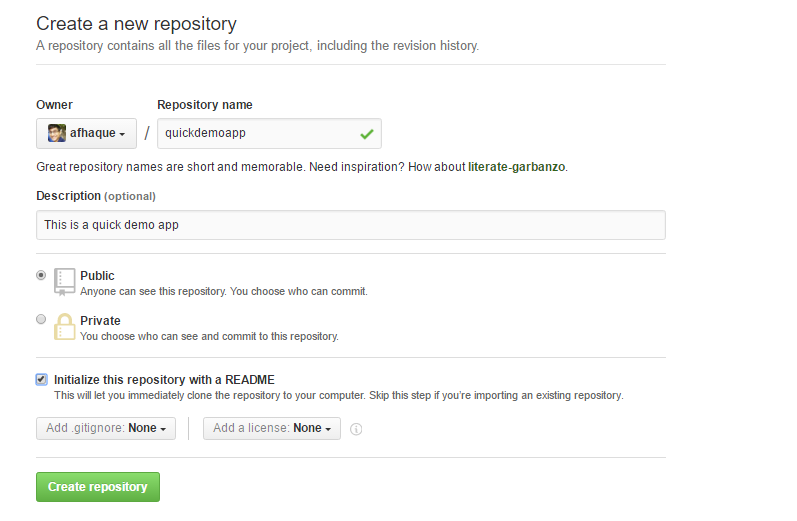

  * Switch back to the Desktop and create a new empty excel file and save it. This will be used to demonstrate how to upload new files.

  * Navigate back to the repo and click **Upload files**.

    

  * Drag the new excel file from the desktop into the repo. Add a commit message and commit the changes.

  * Finally, show that the new file is now safely saved to the repository.

    

* Make sure that all the students have been able to follow along so far. Let students know that this is will be how they will be submitting their homework for the first two weeks. Students will add all of the necessary files to their Github repo then submit the repository link to BCS.

* Encourage students to practice Github before the next class, and to use office hours if they run into any problems that they need help with.

### 3. Instructor Do: Basic Charting (0:20)

* Up until this point in time we haven't touched one of the major features of Microsoft Excel: visualizations. But today we are going to change that. Today we are going to learn how to make charts.

* Ask students to follow along through these next concepts.

  * During this walkthrough, have the TAs slack out the images for where things are located on the opposite operating system. Tell the students you'll be doing this, and mention that the commands and concepts are similar (if you're on Mac, your TAs should slack out the images for Windows).

* Using the [IceCreamFavesIceCreamFaves.xlsx](Activities/01-Ins_GitHub/Resources/IceCreamFaves.xlsx) file, select all of the data in columns A and B. Then navigate into the `Insert` tab at the top of the application to show off all of the nifty charting options that are available in the Charts group.

* **PC**

  

* **MAC**

  

* Excel allows its users to create any number of charts to express their data, but for the time being we are going to be creating a bar chart since that fits our data nicely.

* Whenever you select a charting option from the Charts group, a new menu will appear that allows us to select from a number of visual options. In the case of bar charts we can choose between 2D or 3D visuals with a horizontal or vertical layout.

  * For now, just stick with a vertical 2D chart since it is the most basic.

* Once a chart option has been selected, a new chart will automatically be placed in the spreadsheet. Clicking on this chart will allow us to edit it and, if we so wished, we could double-click on any one element to edit that piece more specifically.

  * For now, click on the chart's title to show your students that we can rename the chart whatever we would like.

* **PC**

  * Next, click on the plus sign to the right of our chart. This brings up a list of elements we can add/remove. Some of these elements have sub-elements which we can choose from as well.

    

  * Click on the "Axes Titles" option to add in titles for both our vertical and horizontal axes. Then click on the arrow to the right of the "Axes Titles" option to bring up the sub-menu, which allows us to choose the specific titles we would like to show.

  * By clicking on the paintbrush to the right of a chart, we can choose a number of basic visual styles from a list. We can also select a color scheme for our chart by selecting a palette from the Color group.

    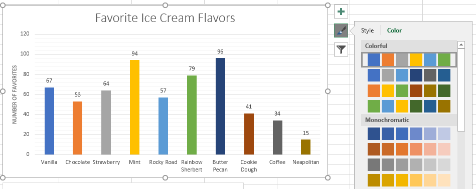

  * Selecting a new color palette may not seem to make much of a difference at first, but if we double-click on the bars of our chart a new menu will appear at the side of the application that allows us to format our bars. If we then click on the paint can and select the "Vary colors by point" option, each bar will be given a different color that fits the palette we selected for our chart earlier.

* **Mac**

  * Click on "Add Chart Element" on the left side of the ribbon and move down to "Axis Titles". Here, you can select Primary Horizontal or vertical.

    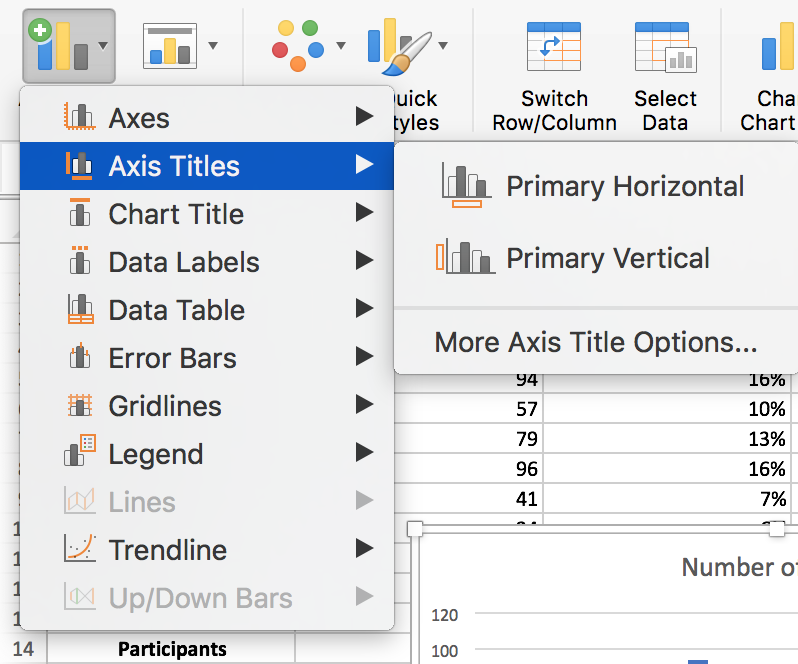

  * Click on "Change Colors" on the ribbon to changes the colors of the bar graph (to the right of the "Add Chart Element").

  * Double click on any of the bars to bring up the "Format Data Series" menu. Here we can check the "Vary colors by point" option that will give each bar a different color.

    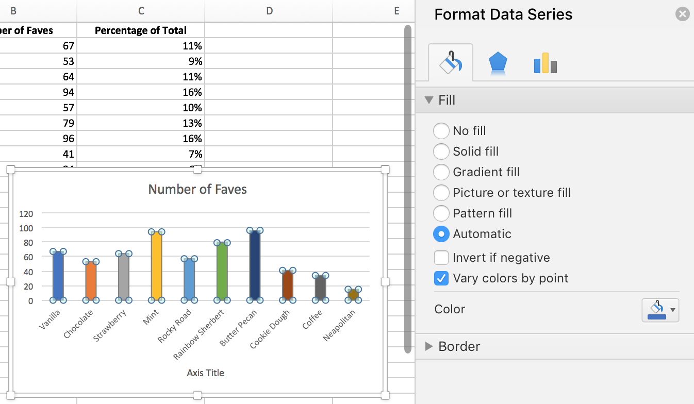

* Point out that the format menu for a chart element can be brought up by double-clicking on any specific element. This gives us even more control over the look of our chart.

* Let's say that we made a bar chart but then our employer told us they really wanted a pie chart. Lucky for us, Excel has an option which allows us to change a chart's type by simply going into the chart's right-click menu and selecting "Change chart type". This means we can turn a bar chart into a pie chart very easily.

  * You can also change a chart's type by selecting the chart, going into the Design tab's Type group, and clicking "Change Chart Type".

  * Turn that bar chart we have been working on into a pie chart. Make sure to add in the "Legend" element for our new pie chart. Otherwise no one will know what each slice of the pie corresponds to.

    * On Macs, you can add a legend by clicking on "Add Chart Element" on the ribbon again, and select add "Legend" and the location.

      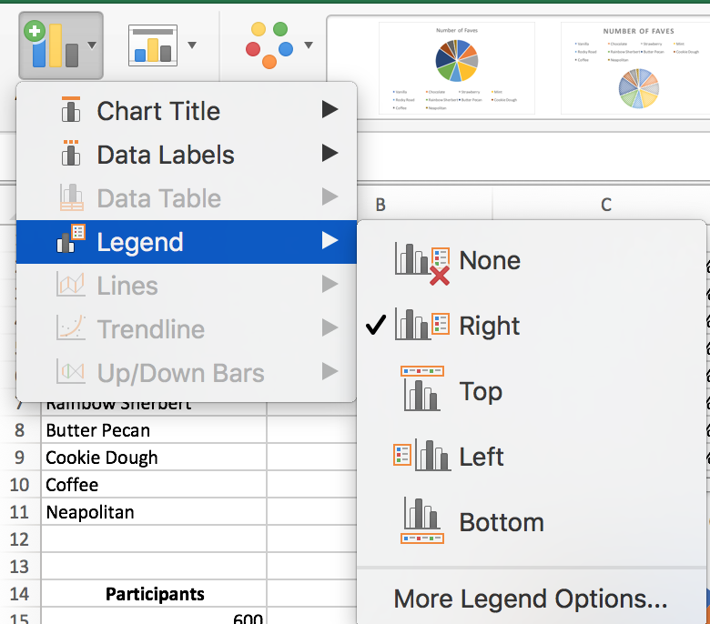

* Another type of graph that is necessary to understand is the line graph. The problem is that the data we currently have is not exactly ideal for creating a line graph... Ask your students why this is the case.

  * Our data does not show any changing trend over time. It instead compares a single piece of data across multiple named categories.

* Open [02-Ins_BasicCharting/Solved/BasicCharts.xlsx](Activities/02-Ins_BasicCharting/Solved/BasicCharts.xlsx) in Excel and go to the second sheet, named Ice Cream Sales. This sheet contains data which shows how many scoops of ice cream flavors have been sold over a period of a year.

  * Select all of the data on this sheet and then choose a 2D line chart from the Charts group on the Insert tab.

    

  * Your students should notice just how cluttered this chart appears to be, which makes it difficult to glean any information from this chart.

    * **PC**: To filter the rows you'd like to show, choose the third option to the right of chart - this allows us to filter what categories of data we would like to show.

      * Select just a couple ice cream flavors from the list and then hit the "Apply" button to filter some data for our chart.

    * **Mac**: To filter what is shown on the chart, choose the `Home` tab, select column `A`, and click `Sort & Filter` in the right of the header (may be hidden in the `Editing` tab at certain screen sizes).

      

      * Select a few ice cream flavors from the list and show the chart updating.

    * It is important to note that the filter options listed here are only helpful in certain cases. When we would like to filter out data based upon some condition (Greater than, Less than, etc.) these limited filter options will not cut it.

* Answer any questions your students may have before moving onto the next activity.

### 4. Students Do: The Line and Bar Grades (0:15)

* Our students are going to take the role of a teacher upon themselves for this activity as they create a series of bar and line graphs that visualize the grades of their class over the course of a semester.

* Slack out the [03-Stu_LineAndBar/README.md](Activities/03-Stu_LineAndBar/README.md) and the [03-Stu_LineAndBar/StudentGrades_Unsolved.xlsx](Activities/03-Stu_LineAndBar/Unsolved/StudentGrades_Unsolved.xlsx) files.

### 5. Everyone Do: The Line and Bar Grades Review (0:05)

* Open and slack out the [03-Stu_LineAndBar/StudentGrades_Solved.xlsx)](Activities/03-Stu_LineAndBar/Solved/StudentGrades_Solved.xlsx) version of the previous activity before going over it with your students. Make certain to answer any questions they may have to the best of your ability before moving onto the next section.

* One of the key factors to cover here is in filtering data within the line chart. Without picking and choosing which students we want to look at in specific, the chart is overcrowded and difficult to read. Sometimes, as in cases like this one, less data on a chart is better than more.

  * They'll also need to "Switch Row/Column" from the Chart Design menu on the line graph.

### 6. Instructor Do: Scatter Plots and Trend Lines (0:10)

* Yet another type of chart that comes in handy when visualizing data is the scatter plot. This type of chart - which consists of a scattering of points on a graph - is extremely handy when checking for relationships between two variables.

* Open [04-Ins_ScatterPlot/ScatterPlot.xlsx](Activities/04-Ins_ScatterPlot/Solved/ScatterPlot.xlsx) in Excel, navigate into the "Normal Trend" worksheet, and show your students how we are using a scatter plot to compare an individual's salary to the price of their car.

* Scatter plots become even more helpful when we then apply a trend line to them. This allows us to further visualize the positive or negative relationship between our variables by plotting a line which best fits our data.

* **PC**

  * Adding a trend line to a chart is very simple. Simply click on the plus symbol to the right of your selected chart and click the "trendline" option.

    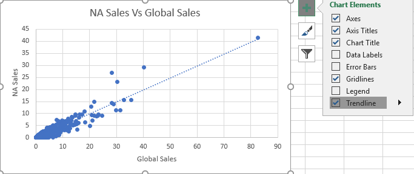

* **Mac**

  * Click "Add Chart Element" on the left side of the ribbon and move down to "Trendline" and select the that best fits our data.

    

* Our original scatter plot showed the most common form of trend line - a straight line - but there are other kinds of trend lines as well that may fit some data sets better.

  * Navigate into the second sheet of the Excel workbook, named Power Trend, and show your students how the Y variable increases exponentially in relation to the X variable. Due to this, the "Power" trend line would fit this data set better.

    * **PC**

      * In order to change the type of trend line that is being used, simply double-click on a chart's trend line and then select one of the options presented to you.

        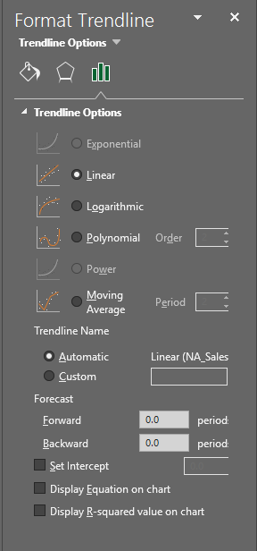

    * **Mac**

      * Click "Add Chart Element" on the left side of the ribbon and move down to "Trendline". This time select "More Trendline Options" to bring up the "Format Trendline" menu.

      * Check the "Power" option.

        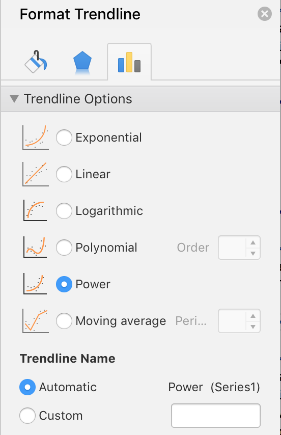

* Navigate into the third sheet of the Excel workbook, named Exponential Trend, and show your students how this data set's second value increases exponentially based upon the row it is contained within. This means that an "Exponential" trend line would best fit this data.

* Another aspect of creating and modifying charts can be done through messing with the axes themselves. For example, if our data increases exponentially, then we may wish to consider creating a chart with axes that also increase exponentially.

  * This can be done by double-clicking on an axis and then changing the bounds, units, and the methods through which the axes are displayed.

  * **Mac**

    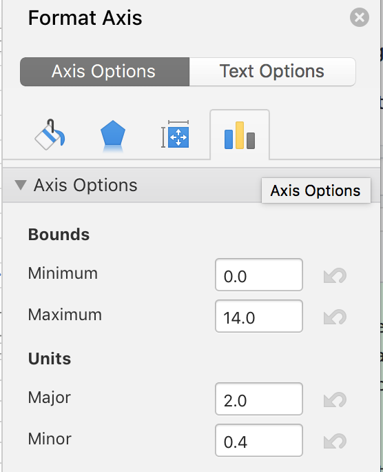

  * Make sure to let your students know that, while editing axes does allow for more customization, it can also be used to make charts misleading. For example, if we used larger units on a data set whose values are fairly low, we could make it look as if the correlation between two variables were far smaller than it really is.

* Students may be wondering how to reverse the X and Y axes of their charts and, unfortunately, there is no simple way to do this for scatter plots. This means that the best way to handle swapping axes is to reverse their positions on the table.

  * This is made all the more annoying by the fact that Excel's charts look at specific positions and ranges. That means that, if you move around data to make one chart, it could change other charts you have created. The best way to avoid this is to copy your chart and paste it into an external program like paint where changing a table's values cannot affect it.

* Answer whatever questions your students may have before moving onto the next activity.

### 7. Partners Do: Video Game Sales (0:15)

* Looking into a product's sales within a region and comparing it to that product's sales worldwide is a great way to determine how important a region is to a company. In this activity, students will pair up in order to create a series of scatter plots which will compare video game sales across regions.

* Slack out the [05-Par_GameSales/README.md](Activities/05-Par_GameSales/README.md) and [Activities/Unsolved/Par_GameSales/VideoGameSales_Unsolved](Activities/05-Par_GameSales/Unsolved/VideoGameSales_Unsolved.xlsx) files.

### 8. Everyone Do: Video Game Sales Review (0:05)

* Open and slack out [05-Par_GameSales/VideoGameSales_Solved.xlsx](Activities/05-Par_GameSales/Solved/VideoGameSales_Solved.xlsx) to your students. Make certain to answer any questions they may have to the best of your ability before moving onto the next section.

* Point out to your class how all of these charts use linear trend lines. Discuss with your students why this might be the case and collect a few of their answers before moving onto the next activity.

### 9. Everyone Do: The Need to Filter (0:15)

* **Files:**

  * [06-Evr_PigeonRacing/Unsolved/PigeonRacing.xlsx](Activities/06-Evr_PigeonRacing/Unsolved/PigeonRacing.xlsx)

* **Activity Notes:**

  * Walkthrough this activity with the class, pausing frequently to allow students to catch up.

* As your students were likely to have noticed, the previous activity included far more information that we could have utilized. It even included categories, like "Publisher", which we could theoretically use in order to look into the sales for specific companies. There is just one small detail getting in our way... Excel's charts have no built-in conditional filtering mechanism. They cannot search through rows and columns and pick out specific data.

  * While this seems like a massive oversight, there is thankfully a simple solution to this problem as Excel includes a filter system for its sheets. This means that we can filter data in a spreadsheet and then make a chart out of that data.

* Tell your students that this is real data from a pigeon racing competition. What is pigeon racing? Why are there people who race pigeons? No clue, but it is a fun data set.

* Select the first row of data on the sheet and then, in the Editing group of the Home tab, click on the "Sort & Filter" button. Next, select "Filter" from the menu that appears.

  * Arrows should appear at the top of each column. By clicking on these arrows, we can choose which rows we would like to filter out of our chart based upon the values that are contained within that column.

    * For example, in the "Sex" column, if we select H then the sheet will display all the rows with an H value.

  * We can then create charts using only the data that is left behind. So if we wanted to create a chart which only takes into account the times for H gendered pigeons, we could now do so.

  * It is very important to note that whatever charts we create using filters will be modified if we change the filtering options again. The way in which to preserve your filtered charts, therefore, is by copying them to an external program like paint or word.

* Play around with this sheet's filtering options with your students for a bit before taking questions and answering them to the best of your ability.

* Another cool thing that you can do to create charts from filtered data is to create a "Pivot Chart".

  * **PC**

    * Pivot charts operate in much the same way as pivot tables do, allowing users to aggregate data of similar types and then create visualizations for them.

    * To create a pivot chart, simply navigate into the Charts group of the Insert tab and select "Pivot Chart" from the options available. Once that is done, simply set up the pivot table you desire and a chart will be created based off of it.

      

  * **Mac**

    * We can also create what is called a Pivot Chart.

    * **NOTE:** Google will tell you there is an issue on 2016 macs, if you find a student have this problem, make sure they run updates their excel, it works on updated versions.

    * There will be students who may worry, but assure them it can be done.

    * First create a pivot table using Sex as our row values. "POS" and "Speed" as value.

    * Click the **!** next to them and switch to **Max** and this will create our pivot table.

    * The result should look as follows

      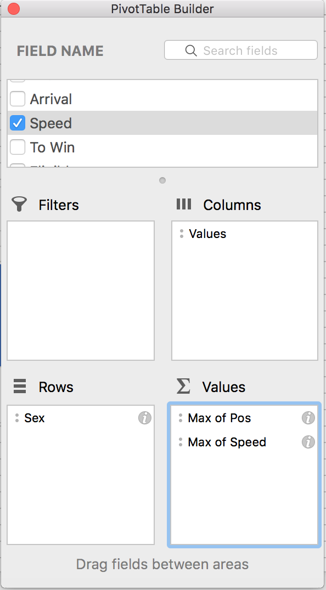

    * Locate "Insert" on the ribbon add any recommended chart to create a Pivot Chart.

    * Now when you play around with the filters in our pivot table, the chart will adjust.

### 10. Partners Do: Filter Game Sales (0:20)

* Now that we know how to apply filters to a spreadsheet and create charts based on filtered data sets, lets take some time to create charts which compare the sales of publishers against one another.

* Slack out the [07-Par_FilterGameSales/README.md](Activities/07-Par_FilterGameSales/README.md) and [07-Par_FilterGameSales/VideoGameSales2_Unsolved.xlsx](Activities/07-Par_FilterGameSales/Unsolved/VideoGameSales2_Unsolved.xlsx) files.

### 11. Everyone Do: Filter Game Sales Review (0:05)

* Open and slack out [07-Par_FilterGameSales/VideoGameSales2_Solved.xlsx](Activities/07-Par_FilterGameSales/Solved/VideoGameSales2_Solved.xlsx) to your students. Make certain to answer any questions they may have to the best of your ability before moving onto the next section.

* **Note** The images for scatter plots in the exercise will be saved in [Nintendo Scatter plot](Activities/07-Par_FilterGameSales/Solved/NintendoVsCritic.png) and [EA Scatter plot](Activities/07-Par_FilterGameSales/Solved/NintendoVsCritic.png)

* Demonstrate that first we select row one and create our filter off of there.

  

* Once you have this, filter "Publisher" to "Nintendo".

  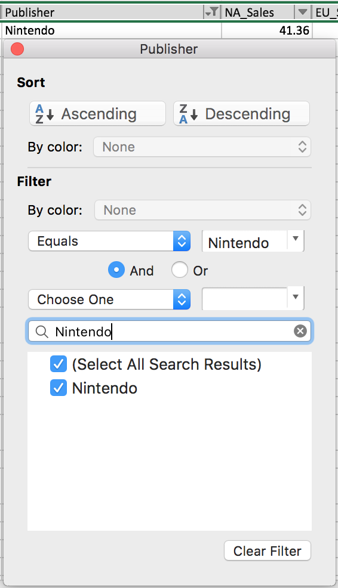

* Explain how to get rid of empty cells by going to the filter for "Critic_Score" and un-checking the "Blanks" box.

* Explain how, in order to create the chart, we need to highlight the columns "Publisher" and "Critic_Score" before inserting a 'scatter plot.'

  * To add labels, click on the Chart Design tab on the ribbon and click "Add Chart Element" and select "Axis Titles".

* Save the image and repeat for "Electronic Arts"

* Explain that for the filtered chart, we first select all the data and create a pivot table.

  * Set the Filter to "Publisher"

  * Set the row as "Year_of_release"

  * Set the values as "Global_sales"

* Finally set the publisher to whomever you want, then highlight the year and sales columns and create a line graph.

* As your students may have noticed during this activity, the charts they created changed whenever they altered their filters. Point out to them once again why this denotes the importance of saving charts externally.

- - -

### 12. BREAK (0:40)

- - -

### 13. Instructor Do: Moving Averages (0:15)

* When creating line graphs in Excel, it is not uncommon for our charts to look rather jagged. While this does have some advantages in expressing how vastly values can change over time, there are times in which it would also be beneficial to show smoother progression.

* This is where the concept of a "moving average" comes into play as it can be used to smooth out irregularities in data (large positive/negative spikes) to allow for easily recognizable trends.

  * Imagine a moving average as being similar to a trend line with the only major difference being that, unlike a trend line, the line of a moving average can change direction over time.

  * Moving averages, like trend lines, should not be considered a replacement for more detailed graphs but should be added in on top of graphs to add more clarity.

* In order to create moving averages, we first need to install a new add-in for Excel called the "Analysis ToolPak".

* Once you have shown the class how to install the "Analysis ToolPak", open [08-Ins_MovingAverages/Solved/MovingAverages.xlsx](Activities/08-Ins_MovingAverages/Solved/MovingAverages.xlsx) in Excel.

  * Navigate into the Data tab, locate the Analyze group, and select the "Data Analysis" option. Macs just have a "Data Analysis" button.

  * From the menu that appears, select "Moving Average".

    

  * Click on the arrow beside "Input Range" and select the cells that you would like to average. In this case, select B2 to M2.

  * Set the interval that you would like to take the average of. We will be setting this particular interval to 2 for the time being.

    * The interval of a moving average is the number of data points that Excel will take the average of. This number includes the current data point as well. So, if we set the interval to 6, the moving average will be the average of the previous 5 data points and the current data point.

    * The higher your interval, the smoother your line will be.

  * Select an output range for the averages you are calculating. In this case, select B3 to M3.

  * Hit "Ok" and Excel will calculate/print the moving average according to your specifications.

    * Students should notice that the first cell of our range has been filled in with the value "#N/A". This is because there are not enough data points prior to this one to calculate an average for.

  

* After creating our moving average, go ahead and make a line chart out of our data to show the class what the final product looks like.

  * Go ahead and set up another moving average, this time with an interval of four to show off how this line is even smoother on our chart.

* Answer whatever questions your students may have on the subject of moving averages before slacking out the next activity.

### 14. Students Do: Golfing Targets (0:15)

* What better way to express moving averages than with a data set that is all about calculating the average accuracy of a golfer? We had 5 golfers take 20 shots onto a green and calculated the distance to the hole. It is up to our students to find the moving averages of their shots using different intervals.

* Slack out the [09-Stu_GolfingTargets/README.md](Activities/09-Stu_GolfingTargets/README.md) and [09-Stu_GolfingTargets/GolfingTargets_Unsolved.xlsx](Activities/09-Stu_GolfingTargets/Unsolved/GolfingTargets_Unsolved.xlsx) files.

### 15. Everyone Do: Golfing Targets Review (0:05)

* Open and slack out [09-Stu_GolfingTargets/GolfingTargets_Solved.xlsx](Activities/09-Stu_GolfingTargets/Solved/GolfingTargets_Solved.xlsx) to your students. Make certain to answer any questions they may have to the best of your ability before moving onto the next section.

* Another use for moving averages which we did not cover over the course of this activity is in comparing the data of a line graph to its averages. This lets us know whether a particular piece of data is well above or below the average and thus can be used to express outliers within data sets.

### 16. Instructor Do: Regression (0:13)

* Explain that we are now going to go over linear regression.

  * Linear regression is relationship between a dependent variable and one or more explanatory or independent variables.

    * For example, more ice cream gets sold when the temperature goes up. Ice cream sales are our dependent variable and the temperature is and independent variable.

* Open [10-Ins_Regression/house_data.csv](Activities/10-Ins_Regression/Solved/house_data.csv) and go through the activity with your class.

  * Click on the data tab in the ribbon, then the "Data Analysis" icon and finally then scroll down to Regression.

    

  * Explain that our `Y Range` is our dependent variable or predictor variable.

  * Click the box on the right side of the input box.

    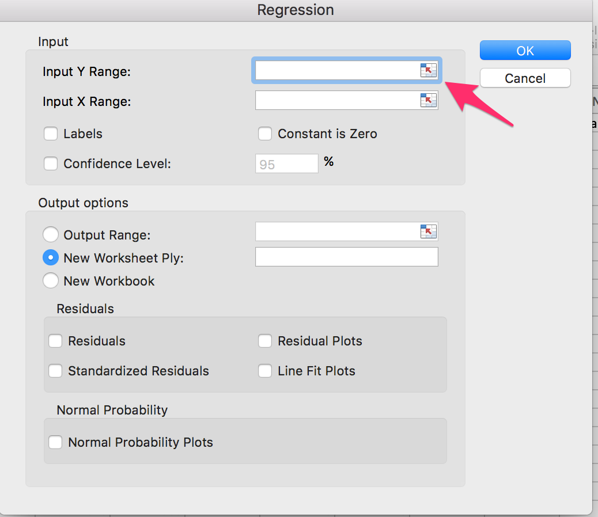

  * Click "price" then hit CMD+SHIFT+DOWN (CTRL+SHIFT+DOWN on Windows) to select the entire column and then hit the down arrow in the selection box.

    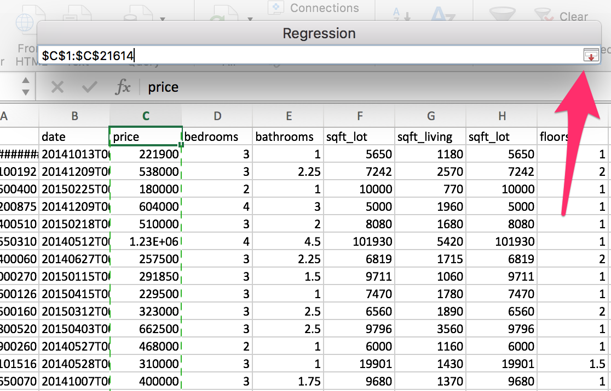

  * Explain that our `X range` is our independent variable or explanatory variables.

  * Click the right of the input box.

  * Select "sqft_living" and highlight the whole column and return back to the screen.

  * Select check the boxes next to `Labels` and `Residuals`.

    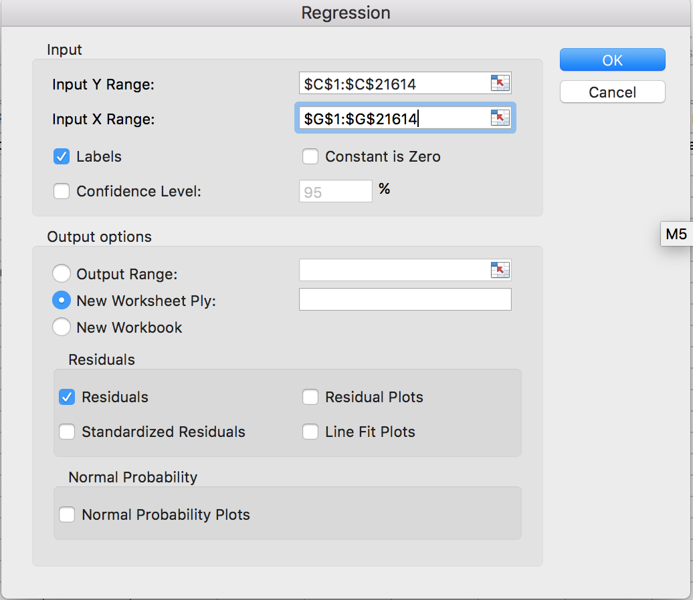

  * Click `OK` to display the results on a new sheet.

* Explain there is a lot going on here but we can pick apart the few pieces of info we need to help explain the results.

  * `R Square` is how close data is to a fitted line, the closer to `1.0` the better, the value in this example is `0.49`, which is not as great as we would like it to be.

  * `Significance F` and `P-values` let us tell how reliable the data is. Values under `0.05` are good, and anything higher means new independent variables should be selected. The value here is `0` so the data is likely be very reliable.

  * `Coefficients` is saying that for each unit increase in price there is and increase is `280.623` square feet of living space.

* Return to the "house_data" sheet and hold the command key as you  highlight both `price` columns and `sqt_living` columns.

  * Click `Insert` on the ribbon then scatter plot.

    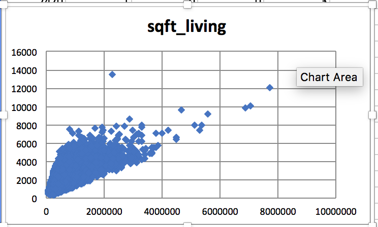

* Explain what you see for the most part is a linear increase. The housing cost does spread pretty wide, which leads to the low low `R Square` value.

  * Have an open discussion with the class why they may think this is.

  * Feel free to play around with the rest of the data and try to figure it out. Most likely the reason has to do with location, living in the city cost more.

### 17. Students Do: Regression Activity (0:15)

* Let's use our newly learned regression skills to take a look at the 2017 NBA season.

* Slack out the [11-Stu_NBAStats/README.md](Activities/11-Stu_NBAStats/README.md) and [11-Stu_NBAStats/2017_nba_season_stats.csv](Activities/11-Stu_NBAStats/Unsolved/2017_nba_season_stats.csv) files.

### 18. Instructor Do: Review Regression Activity (0:05)

* Open and slack out [11-Stu_NBAStats/Solved/NBA_regression.xlsx](Activities/11-Stu_NBAStats/Solved/NBA_regression.xlsx) to your students.

* Explain that we ran regression on `PTS` and `Minutes Played`.

* The `R Square` is 0.82 so much better than 0.5 from the housing data earlier.

* The `Significance F` is `3.49E-222` which very much less than `0.001`

* Explain that the coefficient is saying that for each Unit or minute played, 0.5 points are scored.

* Move to the `2017_nba_season_stats` sheet to look at the scatter plot.

* Ask the students which variables they used and to describe they're findings.

### 19. Instructor Do: Video Guide and End Class (0:02)

* Before finishing up for the night, slack out the [Video Guide](../VideoGuide.md) containing walkthroughs of this week's key activities. Encourage students to review them later and utilize office hours if they have further questions.

* Slack out the installation [instructions](../../../00-Prework/docs/modules/Conda_Installation.md) for Anaconda and ask that students work with TAs during the next week to install Anaconda and Python. This will help resolve installation issues before the Python unit.

- - -

### LessonPlan & Slideshow Instructor Feedback

* Please click the link which best represents your overall feeling regarding today's class. It will link you to a form which allows you to submit additional (optional) feedback.

* [:heart_eyes: Great](https://www.surveygizmo.com/s3/4381674/DataViz-Instructor-Feedback?section=excel-day-3&lp_useful=great)

* [:grinning: Like](https://www.surveygizmo.com/s3/4381674/DataViz-Instructor-Feedback?section=excel-day-3&lp_useful=like)

* [:neutral_face: Neutral](https://www.surveygizmo.com/s3/4381674/DataViz-Instructor-Feedback?section=excel-day-3&lp_useful=neutral)

* [:confounded: Dislike](https://www.surveygizmo.com/s3/4381674/DataViz-Instructor-Feedback?section=excel-day-3&lp_useful=dislike)

* [:triumph: Not Great](https://www.surveygizmo.com/s3/4381674/DataViz-Instructor-Feedback?section=excel-day-3&lp_useful=not%great)

- - -

### Copyright

Trilogy Education Services © 2019. All Rights Reserved.
